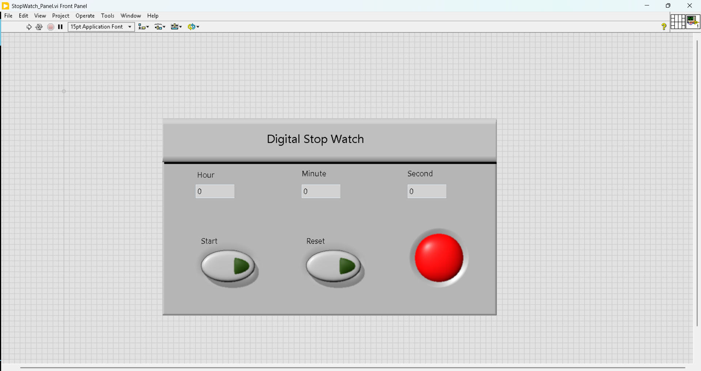
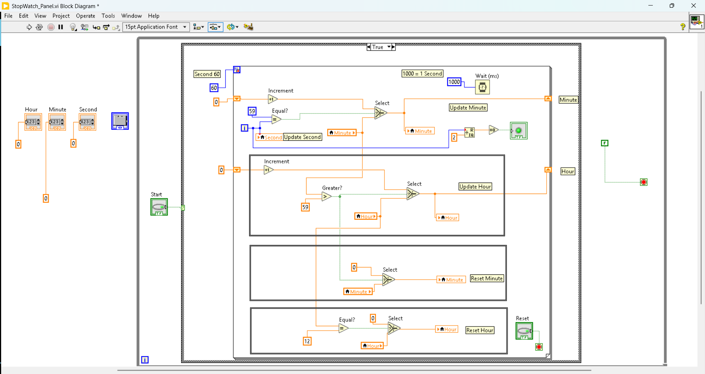

# ⏱️ Digital Stopwatch (LabVIEW + Python)

## 📌 Description
This project implements a digital stopwatch in LabVIEW and automates VI execution using Python (VI Server COM interface).

## 🚀 Features
- Stopwatch UI in LabVIEW
- Python-based VI control
- Automation using COM (pywin32)

## 🛠️ Tools Used
- LabVIEW
- Python
- pywin32

## 📸 Screenshots

### Front Panel

### Block Diagram

## 🎥 Demo
Coming soon...

## 👨‍💻 Author
Adesh Patil
